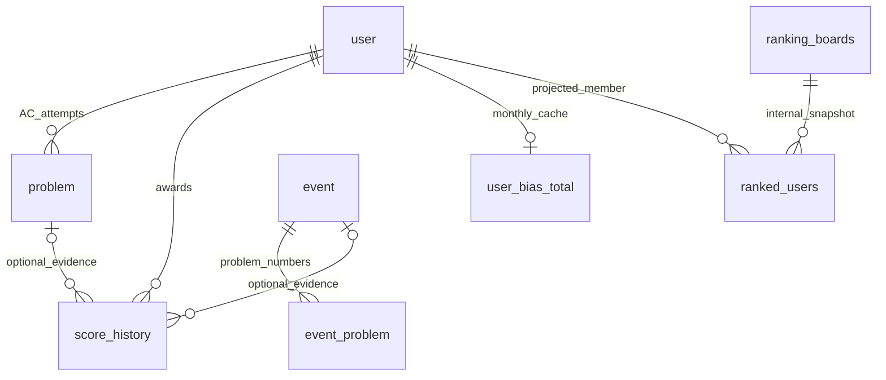

# Jungol 전용 DB 스키마 검토안

[실행 SQL](../../migrations/002_create_jungol_bada.sql)이 이 문서의 산출물이다. 새 MySQL 8.4 논리 DB `jungol_bada`만 생성한다. 기존 DB 수정·복사와 운영 적용은 하지 않았다. SQL은 운영자가 서버에 직접 적용하며 애플리케이션, Compose, CI와 배포 workflow는 스키마 적용이나 버전 관리를 수행하지 않는다.

## 원칙

- 총 **9개 테이블**이다. 핵심 6개는 `user, problem, event, event_problem, score_history, user_bias_total`, 내부 기능 3개는 `ranking_boards, ranked_users, hook`이다.
- `/group/1125/rank`는 메모리 입력 페이지다. rank 테이블과 rank_solved_count는 없다. 실행 로그·채팅 테이블도 없다. hook은 유지한다.
- `corrects`는 페이지의 최근 성공 처리된 “푼 문제” 표시값, `rank_wrong_count`는 표시된 틀린 문제 수, `ac_rating`은 원시 AC rating이다. `submissions`는 저장된 AC 시도 행 수이며 같은 문제 재시도를 포함한다. `solution`은 마지막으로 완전히 검사한 외부 제출 ID로 non-AC ID일 수도 있다.
- `problem`은 문제 사전이 아니라 AC 시도 원장이다. 개별 시도를 모두 저장하고 `verdict='accepted'`를 DB CHECK로 강제한다. 시간은 `submitted_at DATETIME(3) NOT NULL` 하나만 저장한다. 계정 이름은 user_id로 JOIN한다.
- `tier`는 확정된 0–31 정규화 척도다. 원시 `ac_rating`과 섞지 않는다. `AcRatingTierMapper`는 0, 30, 60부터 Ruby I 2950, Master 3000까지의 32개 시작값 중 rating 이하인 가장 큰 시작값의 index를 저장한다.

## 간단 ERD



독립 테이블은 `hook`이다. `event_problem.problem`은 Jungol 문제 번호이며 아직 아무도 풀지 않은 문제도 등록할 수 있어 제출 행 FK가 아니다. 중첩 이벤트를 허용하므로 `problem.event_id`도 없다. `ranking_boards/ranked_users`는 서비스 내부 점수 순위 projection이며 Jungol rank 입력 페이지와 무관하다.

## 3열 검토표

| 유지 | 변경 | 제거 |
|---|---|---|
| hook, 이벤트·지급·월 캐시, 내부 순위 | user.name → jungol_name; kr_name → korean_name | 채팅 테이블, sync_run과 실행·스키마 버전 상태 |
| user.corrects, submissions, solution | problem.time → submitted_at 단일 UTC 시각 | last_rank_seen_at, last_submission_synced_at |
| ac_rating, 0–31 tier | 조회는 problem.user_id JOIN user | atcoder_handle, codeforces_handle, problem.name |
| verdict='accepted'와 외부 제출 UNIQUE | 이름/시각 관련 인덱스를 user_id/submitted_at으로 전환 | submitted_at_ms, time_text |
| 문제 번호·이름·난이도·level·repeatation·score는 이번에 유지 | UI/API 용어·쿼리는 후속 코드 작업 | runtime_ms, memory_kb, code_length_bytes, language |
| 수동 지급의 NULL award_key | 재시도는 corrects+solution 원자적 커밋/롤백 | raw_result_text, grouped_extra_count, problem.created_at |

`problem.created_at`은 업무 조회 기준이 아니므로 제거했다. 이벤트 생성·문제 등록 시각은 소급 지급을 막는 업무 기준이므로 남긴다. score_history.created_at은 지급 귀속 시각, 보드 created_at은 순위 이력 기준, 캐시 updated_at은 캐시 갱신 시각이므로 실행 감사 로그와 다르다.

## 모든 컬럼과 의미

정확한 타입/길이/기본값은 SQL을 정본으로 한다. ID PK는 아래 예외를 제외하고 AUTO_INCREMENT다. NULL은 명시한 필드만 허용한다.

| 테이블 | 컬럼 | 의미 |
|---|---|---|
| user | id | 내부 INT UNSIGNED PK |
| user | jungol_name | 현재 Jungol 이름/handle, VARCHAR(50), 필수·유일 |
| user | korean_name | 한글 표시 이름, VARCHAR(25), NULL 가능 |
| user | jungol_account_id | 불변 외부 계정 BIGINT UNSIGNED ID, 필수·유일 |
| user | corrects | 마지막으로 성공 처리한 페이지 푼 문제 수, UNSIGNED 기본 0 |
| user | rank_wrong_count | 같은 관찰의 틀린 문제 수, UNSIGNED 기본 0 |
| user | submissions | COUNT(problem WHERE user_id=id), UNSIGNED 기본 0 |
| user | solution | 완전 검사 외부 제출 ID, BIGINT UNSIGNED 기본 0 |
| user | ac_rating | 원시 AC rating, INT UNSIGNED NOT NULL DEFAULT 0 |
| user | tier | 정규화 호환 척도, INT 기본 0, CHECK 0–31 |
| user | ignored | 내부 순위/수집 정책의 제외 플래그, 기본 0 |
| problem | id | 내부 AC 시도 BIGINT UNSIGNED PK |
| problem | user_id | user.id FK, INT UNSIGNED |
| problem | problem | Jungol 문제 번호, INT UNSIGNED |
| problem | problem_name | 보강한 문제명 VARCHAR(255), NULL 가능 |
| problem | problem_tier | 문제 난이도, 미상 0; Jungol 매핑은 후속 정책 결정 |
| problem | submitted_at | 유일한 제출 시각, UTC DATETIME(3), 필수 |
| problem | level | 기존 레벨 값, 기본 0; 의미/필요성 다음 검토 가능 |
| problem | repeatation | 동일 계정·문제의 선행 AC 수, 최초 0, 재시도≥1; CHECK≥0 |
| problem | verdict | 결과 상태, 바이너리 비교로 정확히 accepted만 허용 |
| problem | external_submission_id | 외부 제출 BIGINT UNSIGNED ID, 전역 UNIQUE |
| problem | score | 원문 채점 점수 DECIMAL(10,6), NULL 가능; 서비스 지급 bias와 별개 |
| event | id | 이벤트 INT PK |
| event | begin, end | 적용 구간 [begin,end), TIMESTAMP; CHECK begin&lt;end |
| event | title, desc | 제목 필수, 설명 NULL 가능 |
| event | created_at | 이벤트 생성 시각, 소급 지급 방지 기준 |
| event_problem | id | 매핑 INT PK |
| event_problem | event_id, problem | 이벤트 FK와 외부 문제 번호; 쌍 UNIQUE |
| event_problem | added_at | 문제를 이벤트에 추가한 시각; 기존 매핑 유지 시 보존 |
| score_history | id, user_id | 지급 INT PK와 계정 FK |
| score_history | desc, bias | 설명(NULL 가능)과 증감점수; 수동 음수 조정 가능 |
| score_history | rule_type | manual(기본), daily, event |
| score_history | award_key | ASCII 대소문자 구분 멱등키 UNIQUE; 수동 NULL 허용 |
| score_history | score_day | 제출 기준 KST 날짜; 수동 NULL 가능 |
| score_history | event_id, problem_id | 이벤트/원인 AC 시도 FK; NULL 가능, 근거 삭제 후 SET NULL |
| score_history | created_at | 자동 지급은 원인 제출 시각; 수동은 기본 기록 시각 |
| user_bias_total | user_id | user FK이자 PK; AUTO_INCREMENT 아님 |
| user_bias_total | total_point, updated_at | 현재 KST 월 bias 합계 NOT NULL 기본 0; 캐시 갱신 시각 |
| ranking_boards | id, title | 내부 순위 스냅샷 INT PK; 제목 NULL 가능 |
| ranking_boards | created_at, is_active | 생성 시각, 현재 표시 플래그 기본 0 |
| ranked_users | id, board_id, user_id | 순위 행 INT PK, 보드 FK, 계정 FK |
| ranked_users | rank | 1부터 시작하는 순차 내부 순위, CHECK&gt;0 |
| hook | id, url | INT PK, 기존 알림 주소 필수 |
| hook | ignored, created_at | 사용 제외 플래그 기본 1(NULL 허용 호환 유지), 생성 시각 |

이번에 남긴 `problem_name, problem_tier, level, repeatation, score`는 다음 검토에서 각각 필요성을 결정할 수 있다. `repeatation` 철자는 기존 조회에서 사용하므로 이번에는 유지했다. 이름/시간/상태 중복 필드를 다시 추가할 필요는 없다.

## 키·인덱스·삭제

전부 InnoDB/utf8mb4_0900_ai_ci다. user PK/FK는 INT UNSIGNED, problem PK/FK는 BIGINT UNSIGNED, 이벤트·보드 PK/FK는 INT signed로 맞춘다. jungol_name은 대소문자 비구별 UNIQUE이며 외부 account ID가 정체성의 정본이다.

| 테이블 | PK 외 UNIQUE / INDEX |
|---|---|
| user | UNIQUE(jungol_name), UNIQUE(jungol_account_id) |
| problem | UNIQUE(external_submission_id); INDEX(user_id,problem), INDEX(user_id,repeatation,submitted_at), INDEX(repeatation,submitted_at) |
| event_problem | UNIQUE(event_id,problem); INDEX(event_id), INDEX(problem,event_id) |
| score_history | UNIQUE(award_key); INDEX(user_id), INDEX(event_id), INDEX(problem_id), INDEX(user_id,created_at), INDEX(user_id,rule_type,score_day) |
| ranked_users | UNIQUE(board_id,user_id), UNIQUE(board_id,rank); INDEX(board_id), INDEX(user_id) |
| hook | INDEX(ignored,url) |
| 나머지 | PK만 사용 |

FK는 8개이며 UPDATE는 전부 CASCADE다. 사용자 삭제는 제출·지급·캐시·순위 행을 CASCADE 삭제한다. 이벤트 삭제는 매핑을 CASCADE 삭제하고 지급 event_id를 SET NULL로 만든다. 제출 삭제는 지급 problem_id를 SET NULL로 만든다. 보드 삭제는 그 순위 행을 CASCADE 삭제한다. 따라서 지급 원장은 삭제 불가능한 감사 저장소가 아니다. 수집기에는 DELETE 권한이 없다.

자동 지급 CHECK는 rule_type 허용값, 비어 있지 않은 award_key, score_day, bias=1을 강제한다. event_id/problem_id 필수 CHECK는 SET NULL과 충돌하므로 넣지 않는다. 수동 지급은 NULL 멱등키 여러 행이 가능하다. 내부 순위는 현재 순차 순위 계약이며 공동순위를 도입하면 UNIQUE(board_id,rank)를 재검토한다. 활성 보드 하나라는 조건은 projection 트랜잭션이 보장한다.

## 재시도·트랜잭션·시간

한 사용자 트랜잭션에서 계정 행을 잠그고 AC 시도 삽입, 최초 해결/재시도 판단, 일일·이벤트 지급, 월 캐시, 페이지 카운터, 저장 AC COUNT, 커서를 함께 커밋한다. **실패 시 corrects와 solution도 롤백되어 이전 값으로 남는다.** 다음 스케줄의 rank 비교에서 해당 차이가 다시 발견되면 같은 계정을 재시도한다. 페이지 값을 제출 검사 전에 따로 확정해서는 안 된다. 별도 DB 실행 로그/마지막 관찰 시각은 두지 않는다.

재시도 설명은 이전에 관찰된 corrects 차이가 남아 있는 계정에 대한 계약이다. corrects가 변하지 않는 non-AC만의 변화나 페이지 밖 계정까지 새로 탐지하는 안전망을 DB 실행 로그가 제공한다고 가정하지 않는다. solution은 완전히 검사한 지점까지만 전진한다. API 묶음은 저장 전에 개별 시도로 펼치며 같은 외부 제출 ID의 소유 계정/문제 충돌을 단순 IGNORE로 숨기지 않는다. corrects와 로컬 distinct AC 개수의 동등성 조건은 없다.

일일 키는 사용자·KST 날짜, 이벤트 키는 이벤트·사용자·외부 문제 번호를 포함한 결정적 문자열이다. 중복 키는 추가 지급하지 않으며 중첩 이벤트는 각각 +1이다. 이벤트 제출은 [begin,end) 안이고 created_at 및 added_at 이후여야 한다. 이벤트 API는 이벤트와 매핑을 한 트랜잭션에 넣고 남긴 매핑의 added_at을 보존한다. 내부 보드·순위 행·활성 전환도 한 트랜잭션이다. 수동 지급은 원장과 월 캐시를 함께 갱신한다. FK는 키 의미, 지급 자격, cursor 단조성, 집계 일치를 대신 계산하지 않는다.

기존 일일 조건은 최초 해결이며 난이도 0, ≥11, 또는 문제 난이도≥정규화 사용자 tier−5다. **Jungol 원시 rating을 여기에 넣지 않는다.** 문제 난이도를 읽지 못하면 0으로 저장하고 현재 정책에서는 일반 점수 후보로 인정한다. 초기 backfill은 과거 일일 점수를 계산하지만 이벤트 점수는 제외하고, 증분 AC부터 이벤트 점수를 계산한다.

모든 연결은 `time_zone='+00:00'`이다. submitted_at은 UTC 벽시계 DATETIME(3), 나머지 TIMESTAMP는 인스턴트를 저장하고 연결 timezone으로 표시한다. score_day와 월 경계만 Asia/Seoul 달력 기준으로 계산한다. KST 월 시작/다음 달 시작을 UTC로 변환한 반개방 구간으로 집계한다. TIMESTAMP는 MySQL 2038 범위 제한이 있다.

## 후속 시스템 연동 검토

- [x] collector의 user 쓰기와 조회를 jungol_name/ac_rating/tier 확정 스키마로 전환했다.
- [ ] problem.name 조인을 user_id JOIN user로, time 조회·정렬을 submitted_at으로 바꾼다. 제거된 필드를 INSERT/SELECT하지 않는다.
- [x] collector의 채팅·sync_run·schema version 의존을 제거하고 실행 상태는 로그와 health 파일로만 관리한다.
- [ ] corrects=“Jungol 표시 푼 문제 수”, submissions=“저장된 정답 제출 수(재시도 포함)”, solution=“마지막 검사 제출 ID”로 라벨을 바꾼다.
- [ ] corrects/submissions는 정답률이 아니므로 기존 정답률 UI 제거를 권장한다. 실제 정답률에는 전체 제출/non-AC 데이터가 필요하며 현재 AC-only 제안 밖이다.
- [x] collector에서 ac_rating 원본과 0–31 tier를 분리하고 일일 정책에는 tier만 전달한다.
- [x] collector의 월 합계를 명시적인 KST 월 시작/다음 달 시작 반개방 구간으로 전환했다.

## 불변식 점검 예시

첫 두 조회는 정상 상태에서 0행이다. DB 실행 이력 조회는 없다.

```sql
SET SESSION time_zone = '+00:00';
SELECT u.id,u.submissions,COUNT(p.id) AS persisted_ac
FROM user u LEFT JOIN problem p ON p.user_id=u.id
GROUP BY u.id,u.submissions HAVING u.submissions<>COUNT(p.id);

SELECT user_id,score_day,COUNT(*) FROM score_history
WHERE rule_type='daily'
GROUP BY user_id,score_day HAVING COUNT(*)>1;

SELECT u.jungol_name,p.problem,p.submitted_at,p.verdict
FROM problem p JOIN user u ON u.id=p.user_id
WHERE p.repeatation=0 ORDER BY p.submitted_at DESC LIMIT 20;
```

## 최소 권한

이미 생성된 전용 계정의 실제 허용 host로 치환한다. 인증 비밀은 별도 운영 절차로 전달하며 아래에는 없다. SELECT는 수집/점수/projection과 알림에 쓰는 9개 테이블에만 허용한다. hook은 활성 주소 조회와 전송 실패 주소의 `ignored` 갱신에만 사용한다. UPDATE(id)는 no-op upsert를 위한 최소 컬럼 권한이나 권한 자체가 id=id 표현만 강제하지는 않는다. backend의 관리자 권한은 이 collector 계정과 분리한다.

```sql
-- BEGIN COLLECTOR GRANTS
GRANT SELECT ON jungol_bada.user TO 'jungol_collector'@'collector_host';
GRANT SELECT ON jungol_bada.problem TO 'jungol_collector'@'collector_host';
GRANT SELECT ON jungol_bada.event TO 'jungol_collector'@'collector_host';
GRANT SELECT ON jungol_bada.event_problem TO 'jungol_collector'@'collector_host';
GRANT SELECT ON jungol_bada.score_history TO 'jungol_collector'@'collector_host';
GRANT SELECT ON jungol_bada.user_bias_total TO 'jungol_collector'@'collector_host';
GRANT SELECT ON jungol_bada.ranking_boards TO 'jungol_collector'@'collector_host';
GRANT SELECT ON jungol_bada.ranked_users TO 'jungol_collector'@'collector_host';
GRANT SELECT ON jungol_bada.hook TO 'jungol_collector'@'collector_host';
GRANT INSERT (jungol_name,jungol_account_id), UPDATE (id,jungol_name,corrects,submissions,solution,rank_wrong_count,ac_rating,tier) ON jungol_bada.user TO 'jungol_collector'@'collector_host';
GRANT INSERT (user_id,problem,problem_name,problem_tier,submitted_at,level,repeatation,verdict,external_submission_id,score), UPDATE (id) ON jungol_bada.problem TO 'jungol_collector'@'collector_host';
GRANT INSERT (user_id,problem_id,rule_type,award_key,score_day,event_id,bias,`desc`,created_at), UPDATE (id) ON jungol_bada.score_history TO 'jungol_collector'@'collector_host';
GRANT INSERT (user_id,total_point), UPDATE (total_point) ON jungol_bada.user_bias_total TO 'jungol_collector'@'collector_host';
GRANT INSERT (title,is_active), UPDATE (is_active) ON jungol_bada.ranking_boards TO 'jungol_collector'@'collector_host';
GRANT INSERT (board_id,`rank`,user_id) ON jungol_bada.ranked_users TO 'jungol_collector'@'collector_host';
GRANT UPDATE (ignored) ON jungol_bada.hook TO 'jungol_collector'@'collector_host';
-- END COLLECTOR GRANTS
```

## 수동 적용과 복구 한계

1. 승인된 서버의 hostname/version/timezone과 스키마 목록을 조회한다. MySQL 8.4이며 jungol_bada가 존재하지 않아야 한다.
2. 검토한 SQL 해시를 기록하고 보호된 mysql login-path/옵션 파일로 접속한다. `mysql --login-path=approved-target --batch < migrations/002_create_jungol_bada.sql`을 운영자가 수동 실행한다. `--force`는 금지하며 CI/앱 시작 자동 적용은 하지 않는다.
3. 프로세스 exit 0과 정확한 9개 테이블·컬럼·FK·CHECK를 직접 확인한다. 별도의 스키마 버전 표식은 없다.
4. 후속 코드 마이그레이션·권한·UTC 연결 검증을 마친 뒤에만 서비스 연결 전환을 별도로 판단한다.

DDL은 암묵적 커밋이므로 전체 ROLLBACK은 불가능하다. 기존 목적지가 있으면 첫 CREATE DATABASE에서 실패한다. 부분 생성 후 재실행은 복구가 아니다. 서비스를 시작하지 말고 실제 생성물을 조사한다. 새 목적지를 폐기하려면 비어 있는 전용 대상임을 운영자가 확인하고 별도 승인해야 한다. 이 SQL에는 DROP/ALTER/옛 데이터 복사가 없다. 새 DB 데이터를 옛 DB로 합치는 자동 rollback도 없다.

## 검증 범위

전용 migration 자동 검증기는 두지 않는다. SQL 변경은 운영자가 검토한 뒤 서버에 수동 적용한다. collector의 MySQL 통합 테스트는 운영 연결을 사용하지 않고 일회용 테스트 DB에 필요한 스키마를 fixture로 구성할 수 있지만, 운영·stage·dev Compose와 배포 workflow는 이 SQL을 자동 적용하지 않는다.
